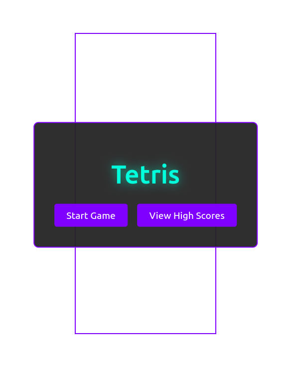
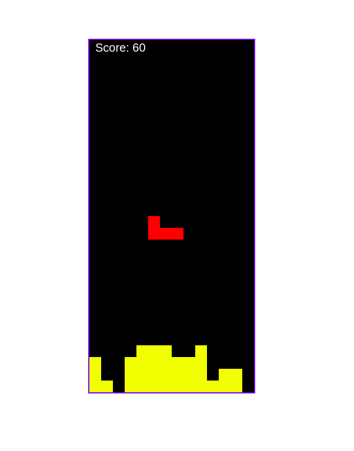

 🎮 Tetris (Vanilla JS + Vite)

A simple **Tetris clone** made with **Vanilla JavaScript** and powered by **Vite** for development and bundling.

## 🚀 Features
- Classic Tetris gameplay
- Piece rotation with wall kicks
- Line clearing and scoring system
- Game over detection
- Fast and lightweight (no frameworks)

## 📦 Installation
Clone the repository and install dependencies:

```bash
git clone https://github.com/guiuCM/Tetris_game.git
cd Tetris_game


## Running
cd tetris/
npm install
npm run dev


## 📷 Screenshots




